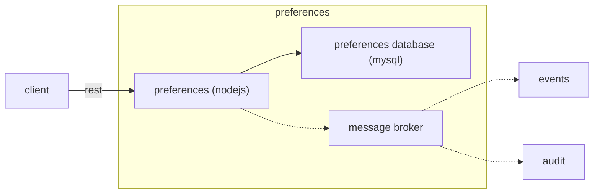

# Introduzione

*Preferences* è un sistema che espone API rest che consente la gestione delle preferenze dell'utente.
Per preferenze si intende le scelte dell'utente riferite ad un determinato servizio digitale.
Attualmente sono supportati i contatti digitali (email,push,sms) e la lingua.



# Getting Started

Per rendere operativo il sistema occorre:
1. creazione dello schema sul database con lo script `dbscript/unppreferences.sql`.
1. impostare gli opportuni valori delle variabili d'ambiente
1. editare il file di configurazione
1. avviare l'applicazione.
1. Usare i servizi (vedi `docs/preferences.yaml`)

## Prerequisites

* Istanza attiva di Postgres
* Componente Message broker attiva per tracciare eventi e audit (opzionale)
* Componente Events attiva per inserire su db gli eventi generati (opzionale)
* Componente Audit attiva per inserire su db i record di audit (opzionale)

## Configuration
La configurazione è basata su variabili d'ambiente e file di configurazione. Una variabile può essere presente sia su variabile d'ambiente che nel file di conf specifico dell'ambiente che nel file di conf generico della componente. All'avvio della comopnente viene effettuato il merge di questi tre entry point. Le variabili se prensenti in più punti (file o env) vengono gestite con la seguente priorità (dalla più alta alla più bassa):
* variabile d'ambiente
* file di conf specifico dell'ambiente
* file di conf generico della componente

Le variabili d'ambiente da valorizzare sono:
* `ENVIRONMENT`: rappresenta l'ambiente di esecuzione (ad esempio dev, tst o prod). Serve per individuare il file di configurazione secondario.

I file di configurazione sono `conf/preferences.json` e`conf/preferences-{ENVIRONMENT}.json`. Ove lo stesso parametro sia presente su entrambi i file il valore in `conf/preferences-{ENVIRONMENT}.json` ha la precedenza.

I principali attributi presenti nei file di configurazione sono elencati di seguito (per l'elenco completo visualizzare il contenuto dei file presenti nella cartella src/conf):

* `db`: contiene la configurazione per la connessione al database. 
    * `host`: l'hostname del dbms
    * `database`: il nome del database a cui accedere
    * `user`: utente con cui accedere al db
    * `password`: password dell'utente del db
    * `schema`: database schema
* `app_name` : nome dell'applicazione (obbligatorio per tracciatura degli eventi e check sicurezza)
* `mb`: contiene la configurazione per il Message Broker.
    * `queues`: contiene le informazioni per le code del message broker
        * `events`: url della coda su cui scrivere gli eventi
        * `audit`: url della coda su cui scrivere i messaggi di audit
    * `token`: il token auth per chiamare il message broker
* `server_port`: porta che utilizzerà l'istanza del server
* `log4js`: la configurazione di log4js (vedi https://www.npmjs.com/package/log4js)
* `security`: contiene la configurazione della sicurezza
    * `secret`: password per verificare firma del token auth utilizzato per chiamare la comopnente
    * `blacklist`: contiene la url per recuperare i token in blacklist
        *`url`: url per recupero token in blacklist

# Token JWT

La sicurezza è gestita tramite token JWT, il token contiene, oltre ai parametri di default (come `iat`, `exp`, ...):
* `preference_service_name`: il nome del servizio
* `applications`: contiene le appicazioni della suite Notify con i relativi permessi assegnati.
* `preferences`: contiene le configurazioni delle eventuali canalità abilitate per il servizio (come ad esempio l'indirizzo email con cui inviare le notifiche email, il token push con cui inviare le notifiche push, ecc...).

La passphrase usata verificare la correttezza della firma del token è contenuta nella variabile d'ambiente `PREFERENCES_SECURITY_SECRET` oppure nel file di configurazione.
Il token JWT viene letto nell'header `x-authentication`.

# Running

Avviare preferences server 
```
cd src && node preferences.js
```

or

```
npm start
```

# Eventi
Il sistema registra su un message broker basato su api rest gli eventi relativi all'esecuzione. Vedi il progetto "eventconsumer" per i dettagli sul formato degli eventi.

# Audit
Il sistema registra su un message broker basato su api rest i messaggi di audit. Tali messaggi sono riferiti alle http request che sono sottoposte al sistema. Le richieste sono correlate grazie all'header `X-Request-ID`. Se tale header non è popolato allora il sistema ne genera uno automaticamente. Vedi il progetto "auditconsumer" per i dettagli del formato.


## Use case

Vedere file **UseCase.md**.